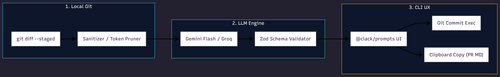

# SCOMMIT

**Autonomous CLI for Conventional Commits, PR Summaries & Risk Scoring**

[](https://www.typescriptlang.org/)
[](https://zod.dev/)
[](https://ai.google.dev/gemini-api)
[](https://nodejs.org/)
[](LICENSE)

## Problem Statement

Commit hygiene is often a repeated manual tax: developers spend several minutes turning a staged diff into a correctly scoped Conventional Commit, reviewers reconstruct context for PR descriptions, and release owners make deployment decisions with incomplete risk signals. Across a team making 20 commits per engineer per week, even five minutes of formatting and summarization becomes more than 33 engineer-hours per month for 10 engineers. The harder cost is inconsistency: subjective summaries and unstructured risk notes make changes difficult to scan and compare.

`scommit` makes the staged diff the source of truth. It produces a Conventional Commit message, a structured PR summary, and a 1-to-5 risk score with a reason, while keeping the final execution decision with the developer.

## Architecture & Pipeline



The pipeline is intentionally narrow and inspectable:

1. **Diff Extraction**: runs `git diff --cached --no-ext-diff`, requires staged content, and passes only the staged delta to the analysis boundary.
2. **Token Pruning**: parses files and hunks, prioritizes source files, bounds each file body, and fits the selected context to the configured character budget.
3. **LLM Inference**: sends a deterministic system instruction to Google Gemini.
4. **Schema Enforcement**: requests a native response schema, parses the payload, and validates every field with Zod before rendering or executing anything.
5. **Terminal / Clipboard UX**: renders the commit and risk preview, formats the PR summary as Markdown, and exposes commit, copy, combined, and cancel actions.

## Engineering Highlights & Trade-offs

### Deterministic Output Contract

The output contract is represented once in `CommitAnalysisSchema`: the commit must match Conventional Commit syntax, the summary fields must be non-empty where required, and the risk score must be an integer from 1 through 5. Gemini receives a native JSON response schema, while Zod remains the trust boundary so malformed JSON, missing fields, and semantically invalid values fail before a commit or clipboard write is attempted. This does not make model output infallible; it makes invalid output observable and non-executable.

### Token Conservation Strategy

Diff context is conserved in three layers:

- Hunk-aware rendering preserves diff metadata and only slices hunk content when a file exceeds its budget.
- Source files are prioritized over secondary documentation and lower-signal file types. Lockfiles and other generated artifacts are naturally deprioritized by the extension policy rather than given equal weight with source code.
- The default analysis bound is 16,000 characters, with a `--max-chars` override for controlled experiments or unusually large changes. Individual file bodies are capped at 4,000 characters and marked when truncated.

The trade-off is deliberate: a bounded, representative diff usually yields a faster and more stable explanation than an unbounded payload, while the explicit truncation marker makes lost context visible to the model and the operator.

### Sub-2s Latency Architecture

The CLI performs one local Git read, one compact prompt, and one Gemini request. Flash-class models are designed for low-latency structured generation, and the provider-specific details remain behind the LLM client.

Treat sub-two-second response time as a target for normal-sized staged diffs, not a universal guarantee. Network distance, provider load, quota state, diff size, and cold starts are external variables. The architecture keeps the local portion deterministic and small so provider latency is the dominant, measurable term.

## Getting Started

### Prerequisites

- Node.js 18 or newer
- Git
- A Gemini API key

### Installation

Install the published CLI globally:

```bash
npm install -g scommit
```

For local development:

```bash
git clone <repository-url>
cd scommit
npm install
npm run build
npm link
```

### Configuration

`scommit` requires `GEMINI_API_KEY` to analyze staged diffs and produce a structured Conventional Commit message, PR summary, and risk score.

#### Get a Gemini API key

Get a free key from [Google AI Studio](https://aistudio.google.com/):

1. Sign in with your Google account.
2. Select **Get API key**, create or select a project, and copy the generated key.

#### Option A: Global Environment Variable

Set `GEMINI_API_KEY` in your user environment.

**Windows PowerShell**

```powershell
[System.Environment]::SetEnvironmentVariable('GEMINI_API_KEY', '<key>', 'User')
```

**macOS, Linux, or WSL**

Add the export to `~/.bashrc` or `~/.zshrc`:

```bash
echo 'export GEMINI_API_KEY="<key>"' >> ~/.bashrc
source ~/.bashrc
```

#### Option B: Global Dotenv File

For a persistent fallback, create `~/.scommit.env` in your home directory:

**Windows PowerShell**

```powershell
Set-Content -Path "$HOME/.scommit.env" -Value 'GEMINI_API_KEY=<key>'
```

**macOS, Linux, or WSL**

```bash
echo 'GEMINI_API_KEY=<key>' > ~/.scommit.env
```

Keep this file private and never commit it. For local development, you can also use a project `.env` file:

```dotenv
GEMINI_API_KEY="your_gemini_api_key_here"
```

> **Windows & VS Code:** Newly added Windows environment variables are not inherited by already-open terminals, PowerShell sessions, or VS Code instances. Close and reopen terminals, restart PowerShell, and reload or restart VS Code before running `scommit`.

## Usage

Stage changes first, then run:

```bash
scommit
scommit --dry-run
scommit --max-chars <n>
```

| Command                   | Purpose                                                              |
| ------------------------- | -------------------------------------------------------------------- |
| `scommit`                 | Analyze the staged diff, show the preview, and open the action menu. |
| `scommit --dry-run`       | Show the analysis without committing or copying anything.            |
| `scommit --max-chars <n>` | Set the maximum staged-diff characters sent to the model.            |

### Interactive Menu

After the analysis preview, the terminal presents four actions:

- **Commit directly**: execute `git commit` using the generated Conventional Commit message.
- **Copy PR Summary & Commit**: copy the Markdown PR summary to the system clipboard, then create the commit.
- **Copy PR Summary only**: copy the summary without changing Git history.
- **Cancel**: exit without copying or committing.

`--dry-run` is the review and automation-friendly mode: it renders the same generated artifacts while bypassing the interactive action boundary.

## Development

```bash
npm run dev -- --help
npm run build
```

The project is a small TypeScript ESM CLI. Provider integrations live behind the LLM client, the schema is centralized, and Git mutation is kept behind the action layer so the analysis path remains testable and reviewable.

## License

MIT
