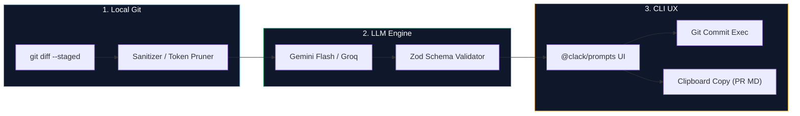

# SCOMMIT: Conventional Commits, PR Summaries & Risk Analysis

[](https://www.typescriptlang.org/)
[](https://zod.dev/)
[](https://ai.google.dev/gemini-api)
[](https://nodejs.org/)
[](LICENSE)

## 📄 Summary

`scommit` is a local CLI that turns the staged diff into a **Conventional Commit**, a **structured Pull Request summary**, and a **risk score from 1 to 5**. It uses Google Gemini to analyze changes while keeping the final decision to execute, copy, or cancel with the developer.

The project reduces the manual work of interpreting changes, writing consistent commit messages, and preparing review context. The staged diff is treated as the single source of truth, and no file outside that scope is sent for analysis.

---

## 🎯 The Problem

Turning a set of changes into a clear commit message and a useful PR summary is repetitive work. Different descriptions of the same kind of change also make history harder to scan and risk harder to assess during reviews.

An automated tool must balance two risks: too much context can make analysis slow and unstable, while too little can hide important information. Invalid model output must also be prevented from creating a commit or being copied as a trusted result.

---

## 💡 The Solution

`scommit` implements a small, local, validated pipeline:

1. **Staged diff extraction:** runs `git diff --cached --no-ext-diff` and requires staged changes.
2. **Context reduction:** preserves relevant files and hunks, prioritizes source code, and applies character limits.
3. **Structured analysis:** sends a deterministic instruction to Google Gemini and requests a native-schema JSON response.
4. **Contract validation:** uses Zod to validate the Conventional Commit message, summary, and risk score.
5. **Controlled action:** shows a terminal preview and lets the developer commit, copy the summary, do both, or cancel.

---

## 🏛️ Solution Architecture



### 1. Diff extraction and prioritization

Git provides only staged changes. The parser preserves file and hunk metadata, prioritizes source files, and limits each file body to 4,000 characters. The total analysis context defaults to 16,000 characters and can be adjusted with `--max-chars`.

### 2. Google Gemini inference

The LLM client sends the selected context with a deterministic instruction and requests a structured response. Provider integration remains isolated behind the LLM client, keeping the rest of the pipeline independent from API details.

### 3. Response validation

The contract centralized in `CommitAnalysisSchema` validates commit syntax, required summary fields, and an integer risk score from 1 through 5. Invalid JSON, missing fields, or semantically incorrect values fail before any clipboard write or Git history change.

### 4. Preview and execution

The terminal displays the generated commit, change summary, and risk rationale. The action layer keeps Git mutation separate from analysis so the developer can review the result before execution.

---

## ✨ Key Features

- **Conventional Commit:** generates a message compatible with the Conventional Commits standard.
- **Pull Request summary:** produces a title, summary, key changes, and review notes in Markdown.
- **Risk analysis:** scores the change from 1 to 5 and explains the rationale.
- **Bounded context:** limits diff size and marks truncated files.
- **Source prioritization:** favors source files over documentation, lockfiles, and lower-signal artifacts.
- **Zod validation:** prevents invalid responses from reaching execution.
- **Dry-run mode:** `--dry-run` shows the result without copying or creating a commit.
- **Integrated clipboard:** copies the PR summary directly to the clipboard.
- **Explicit actions:** commit, copy and commit, copy only the summary, or cancel.

---

## 🛠️ Technology Stack

- **Language:** TypeScript with ESM modules.
- **Runtime:** Node.js 18 or newer.
- **Artificial intelligence:** Google Gemini Flash via `@google/generative-ai`.
- **Validation:** Zod.
- **Terminal interface:** `@clack/prompts` and `chalk`.
- **Git and processes:** `execa`.
- **Clipboard:** `clipboardy`.
- **CLI:** Commander.
- **Configuration:** dotenv and environment variables.
- **Build:** tsup.

---

## 🚀 Development Journey and Key Concepts

1. **Local foundation:** the flow started with staged diff reading and Git command execution through a TypeScript CLI.
2. **Representative context:** analysis evolved into file and hunk selection with priorities and limits to avoid unnecessarily large payloads.
3. **Structured contract:** model output adopted a native schema and Zod validation before any action.
4. **Separation of concerns:** diff extraction, LLM analysis, rendering, and Git mutation remain in separate modules.
5. **Review experience:** the result gained a preview, `--dry-run`, summary copying, and an explicit action menu.

---

## 🤔 Challenges and Lessons Learned

- **Context versus latency:** limiting the diff improves predictability, but requires prioritizing the content with the highest analysis value.
- **Model responses are not contracts:** native schemas help, but Zod validation remains the trust boundary.
- **Automation with human control:** generating artifacts automatically should not mean creating commits without an explicit decision.
- **External latency:** the local flow is deterministic, but network distance, provider load, quota, diff size, and cold starts affect total time.

---

## ⚙️ Installation and Configuration

### Prerequisites

- Node.js 18 or newer
- Git
- A Gemini API key

### Global installation

```bash
npm install -g scommit
```

### Local development

```bash
git clone <repository-url>
cd scommit
npm install
npm run build
npm link
```

### Gemini API key

Create a free key in [Google AI Studio](https://aistudio.google.com/) and configure `GEMINI_API_KEY` in the user environment.

**Windows PowerShell**

```powershell
[System.Environment]::SetEnvironmentVariable('GEMINI_API_KEY', '<key>', 'User')
```

**macOS, Linux ou WSL**

```bash
echo 'export GEMINI_API_KEY="<key>"' >> ~/.bashrc
source ~/.bashrc
```

Alternatively, create `~/.scommit.env`:

```dotenv
GEMINI_API_KEY="your_gemini_api_key_here"
```

Keep this file private and never commit it. On Windows and in VS Code, restart terminals after adding a new environment variable.

---

## ▶️ Usage

Stage your changes and run:

```bash
scommit
scommit --dry-run
scommit --max-chars <n>
```

| Command                   | Purpose                                                              |
| ------------------------- | -------------------------------------------------------------------- |
| `scommit`                 | Analyze the staged diff, show the preview, and open the action menu. |
| `scommit --dry-run`       | Show the analysis without copying or creating a commit.              |
| `scommit --max-chars <n>` | Set the maximum number of characters sent to the model.              |

After the preview, the menu offers:

- **Commit directly:** execute `git commit` with the generated message.
- **Copy PR summary and commit:** copy the Markdown and create the commit.
- **Copy PR summary only:** copy the summary without changing history.
- **Cancel:** exit without copying or creating a commit.

---

## 🧪 Development

```bash
npm run dev -- --help
npm run build
```

Provider integrations remain behind the LLM client, the schema is centralized, and Git mutations stay in the action layer. This keeps the analysis path small, reviewable, and easy to test.
